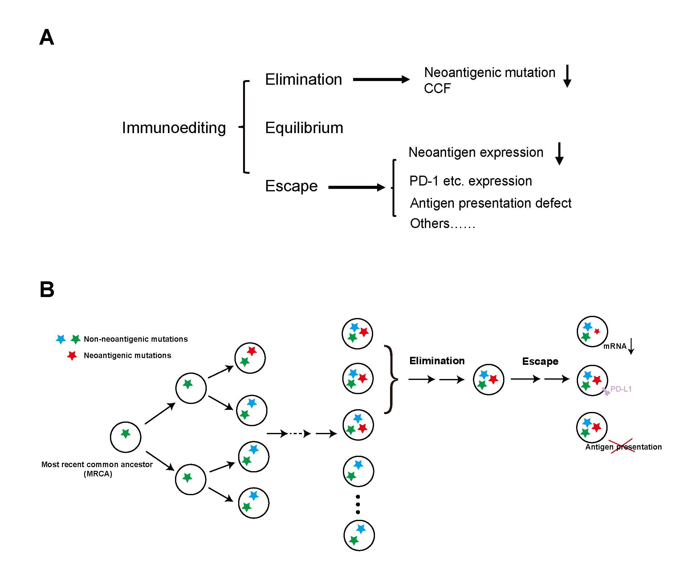
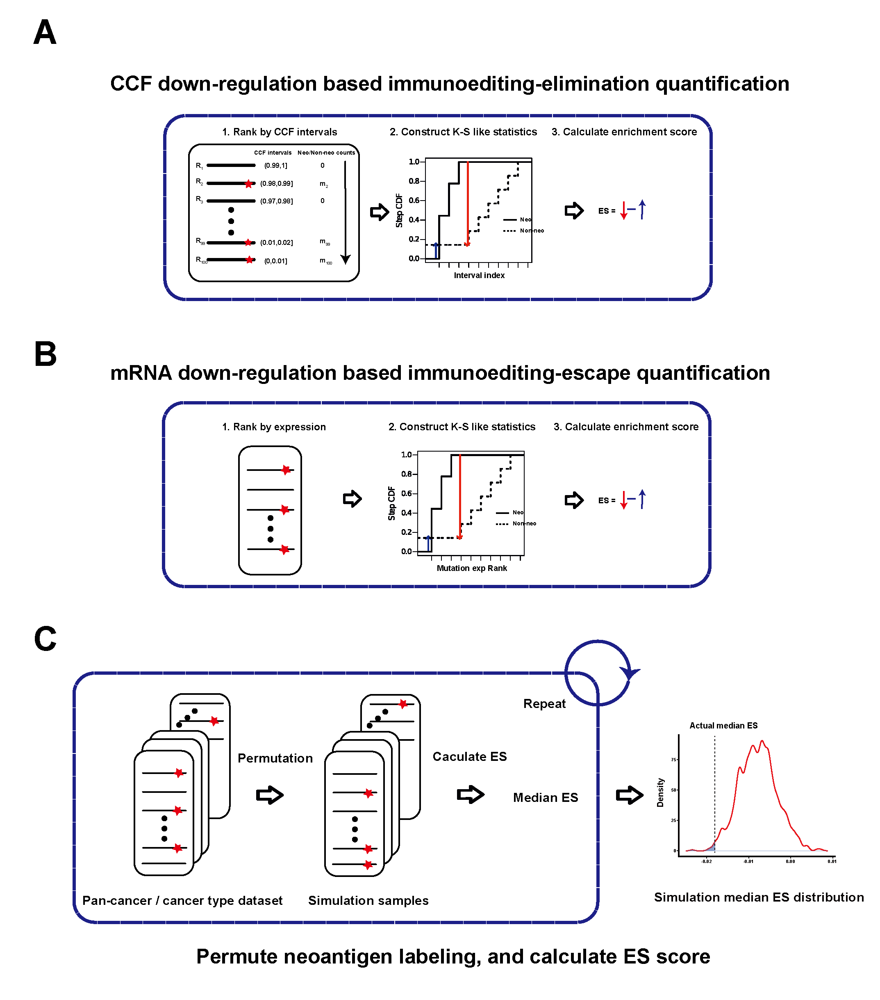
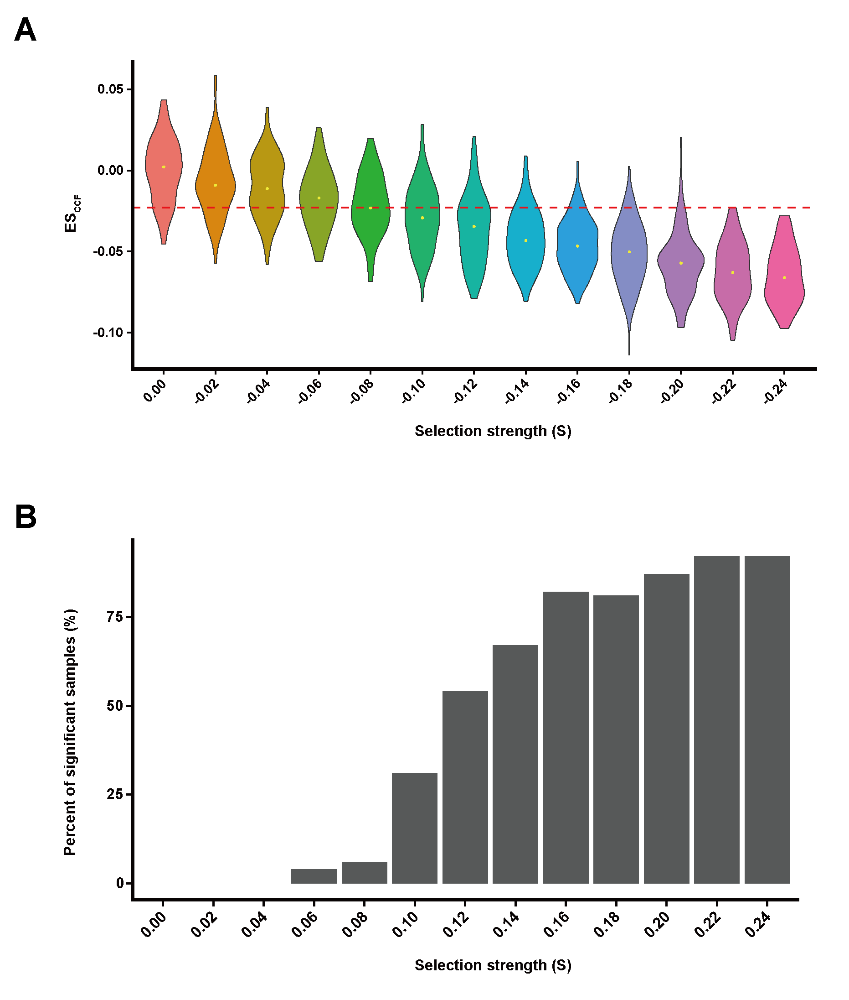

---
#ESSENTIALS
title: "Quantification of neoantigen-mediated immunoediting in cancer evolution"
poster_height: "35in"
poster_width: "23in"
author:
  - name: Tao Wu
    affil: 1 
  - name: Guangshuai Wang
    affil: 1
  - name: Xuan Wang
    affil: 1
  - name: Shixiang Wang
    affil: 1
  - name: Xue-Song Liu
    affil: 1, 2
affiliation:
  - num: 1
    address: School of Life Science and Technology, ShanghaiTech University, Shanghai 201203, China
  - num: 2
    address: Corresponding Author
column_numbers: 3
output: 
  posterdown::posterdown_html:
    self_contained: false
bibliography: packages.bib
link-citations: false
title_textsize: "60pt"
author_textsize: "35pt"
affiliation_textsize: "30pt"
body_textsize: "27px"
sectitle_textsize: "28px"
# knit: (function(inputFile, encoding) { rmarkdown::render(inputFile, encoding = encoding, output_file = file.path(dirname(inputFile), 'index.html')) })
header-includes:
   - usepackage{caption}
   - captionsetup[figure]{font=\tiny}
---

```{r, include=FALSE}
knitr::opts_chunk$set(echo = FALSE,
                      warning = FALSE,
                      tidy = FALSE,
                      message = FALSE,
                      fig.align = 'center',
                      out.width = "100%")
options(knitr.table.format = "html") 
```

# Abstract

Immunoediting, which includes three temporally distinct stages, termed elimination, equilibrium, and escape, has been proposed to explain the interactions between cancer cells and the immune system during the evolution of cancer. However the status of immunoediting in cancer remain unclear, and the existence of neoantigen depletion signal in untreated cancer has been debated. Here we developed a distribution pattern based method for quantifying neoantigen mediated negative selection in cancer evolution. Our method provides a robust and reliable quantification for immunoediting signal in individual cancer patient. The prevalence of immunoediting signal in immunotherapy untreated cancer genome has been demonstrated with this method. Importantly, the elimination and escape stages of immunoediting can be quantified separately, tumor types with strong immunoediting-elimination tend to have weak immunoediting-escape signal, and vice versa. Quantified immunoediting-elimination signal predicts cancer immunotherapy clinical response. Immunoediting quantification provides an evolutional perspective for evaluating the immunogenicity of neoantigen, and reveals potential biomarker for cancer precision immunotherapy.

# Results

```{r, figure1, fig.cap='Conceptual framework for the quantification of elimination and escape phases of immunoediting.', out.width="80%"}

```

```{r, figure2, fig.cap='Distribution pattern based method for the quantification of neoantigen mediated negative selection in cancer evolution.', out.width="80%"}

```

```{r, figure3, fig.cap='Pan-cancer distributions and features of the quantified immunoediting signals (ESCCF and ESRNA).', out.width="100%"}
knitr::include_graphics("Fig/Fig3.png")
```

```{r, figure4, fig.cap='Immunoediting-elimination signal (ESCCF) and neoantigen-mediated negative selection strength quantification.', out.width="100%"}

```

```{r, figure5, fig.cap='Quantified immunoediting-elimination signal (ESCCF) predicts cancer immunotherapy clinical response.', out.width="100%"}
knitr::include_graphics("Fig/Fig5.png")
```

# Conclusion

- Developed a brand new method for reliably quantifying neoantigen mediated immunoediting in individual cancer patient.
- With the new analysis framework, we demonstrate the pan-cancer existence of neoantigen mediated negative selection signal.
- Elimination and escape stages of immunoediting can be quantified separately,
tumor types with strong immunoediting-elimination tend to have weak immunoediting-escape signal, and vice versa.
- Quantified immunoediting-elimination signal predicts cancer immunotherapy clinical response.

# Acknowledgement

We thank the authors and participating patients of immunotherapy publications for providing the data for this analysis. Our gratitude is also extended to the TCGA project for making cancer genomics data available for analysis. Thank ShanghaiTech University High Performance Computing Public Service Platform for computing services. Thanks also to other members of Liu lab for helpful discussion. 

***

[©Cancer Biology Group](https://github.com/XSLiuLab/) 2021
